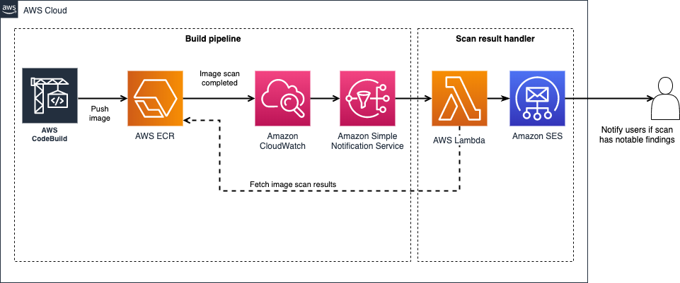

# ECR Image Scan Result Handler Lambda

This repository contains an easy-to-deploy lambda handler to handle the ECR image scan results.

To increase security finding handling in your project you might want to get notifications about issues in your images.

[Learn more about ECR image scanning](https://docs.aws.amazon.com/AmazonECR/latest/userguide/image-scanning.html)

What you should have in place:

* ECR repositories
* Image scanning enabled on them
* A SNS topic that gets notified when there are image scan results available



## What this lambda does

When the lambda is triggered from the ECR image scan results it will go and fetch the image scan results to see if there are any reported problems.

If scan finds any issues, the lambda will send an email to predefined address to notify the developers.

The implementation consists of three parts:

* `lambda-handler/` contains the actual lambda code
* `lambda-runtime-layer/` contains a runtime layer for the lambda with the needed AWS SDK
* `cdk/` contains deployment code for the functionality

We must include the latest AWS SDK in a Lambda Layer since nodejs12.x runtime contains AWS SDK version 2.536.0 which does not include the ECR image scan compatibility (released in 2.557.0).

### Configuration

Configure the SNS topic and sender address in the `cdk.json` file. You might have to verify the email in Amazon SES service.

```json
cdk.json
{
  "app": "node dist/index",
  "context": {
    "from_email": "from@example.com",
    "target_email": "target@example.com",
    "notification_topic": "arn:aws:sns:eu-west-1:992821666999:ExampleStack-ImageScanCompletedTopic08428532-RTLEXMO8349I"
  }
}
```

### Deployment

In `cdk` directory run the following commands:

```bash
cdk cdk
npm run build
cdk deploy EcrImageScanResultHandler
```
